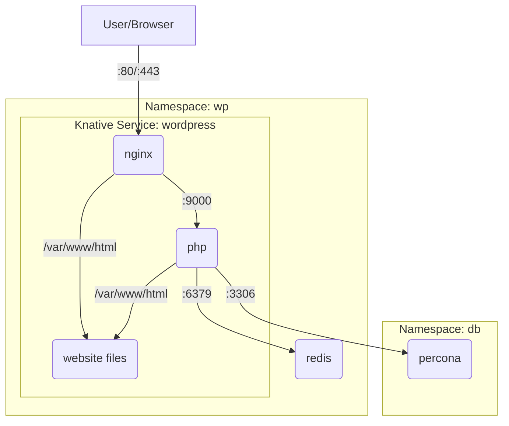

# Knative WordPress

This repository contains a Knative service for running WordPress. [Knative](https://knative.dev/) is a Kubernetes-based platform to deploy and manage serverless workloads. This example uses a Knative service consisting of a [PHP image](https://hub.docker.com/_/wordpress) an [Nginx image](https://hub.docker.com/_/nginx), and a [Redis image](https://hub.docker.com/_/redis). The example also uses the [Percona Operator](https://docs.percona.com/percona-operator-for-mysql/pxc/kubectl.html) to deploy the backing database.

This example does not include page caching which is left as an exercise for the reader. However the example does include a redis based database cache with a persistently live leader and followers in every serverless workload. There are [a few alternative routes](docs/notes-on-database-cache.md) for database caching that look promising as well.

Additionally, this example is prepared to use a Kubernetes 1.31 alpha feature [Read Only Volumes Based On OCI Artifacts](https://kubernetes.io/blog/2024/08/16/kubernetes-1-31-image-volume-source/) but the feature has [not yet shipped](https://github.com/knative/serving/pull/15878) in Knative. As an alternative, a scratch image is added to the Knative service with the WordPress site files and a `sleeper` binary to keep the container running indefinitely. The files are shared via an empty volume mounted to all containers in the service. This is not ideal but works for now.

This example is also missing a method to offload media uploads though I have a [few ideas](docs/notes-on-media-uploads.md) on that.

## Service Diagram



## Kind Setup

Spin up a kind cluster with Knative installed:

```sh
# install kind
brew install kind

# install knative cli
brew install knative/client/kn

# install knative quickstart plugin
brew install knative-extensions/kn-plugins/quickstart

# create a kind cluster with knative
kn quickstart kind
```

Now deploy the application
```sh
kubectl apply -k config
```

## Database Setup

Create the database

```sh
# Get the root password from the secret
kubectl get secret -n db internal-cluster1 --template='{{.data.root | base64decode}}{{"\n"}}'

# Create a shell in a MySQL client pod
kubectl run --rm -i -n db --tty mysql-client --image=mysql:latest --restart=Never -- bash -il

# Connect to the MySQL server
mysql -h cluster1-haproxy -u root -p

# Create the WordPress database
CREATE DATABASE wordpress;

# Create a user for WordPress
CREATE USER 'wordpress'@'%' IDENTIFIED BY '<password>';
GRANT ALL PRIVILEGES ON wordpress.* TO 'wordpress'@'%';
FLUSH PRIVILEGES;
```

Finally, set the database password in the `config/wordpress/secret.yaml` file and reapply the configuration:

```sh
kubectl apply -k config
```

## Accessing the WordPress Site

You can access the WordPress site at http://wordpress.wp.127.0.0.1.sslip.io/.

You may want an admin user to log into the WordPress dashboard. You can create an admin user by running the following command:

```sh
# Create a shell in a MySQL client pod
kubectl run --rm -i -n db --tty mysql-client --image=mysql:latest --restart=Never -- bash -il

# Connect to the MySQL server
mysql -h cluster1-haproxy -u root -p

# Create a WordPress admin user
INSERT INTO `wordpress`.`wp_users` (`ID`, `user_login`, `user_pass`, `user_nicename`, `user_email`, `user_url`, `user_registered`, `user_activation_key`, `user_status`, `display_name`) VALUES ('3', 'test', MD5('test'), 'Test User', 'test@n8.gay', '', '2025-07-06 00:00:00', '', '0', 'Test User');
INSERT INTO `wordpress`.`wp_usermeta` (`umeta_id`, `user_id`, `meta_key`, `meta_value`) VALUES (NULL, '3', 'wp_capabilities', 'a:1:{s:13:"administrator";s:1:"1";}');
INSERT INTO `wordpress`.`wp_usermeta` (`umeta_id`, `user_id`, `meta_key`, `meta_value`) VALUES (NULL, '3', 'wp_user_level', '10');
```

## Load Testing

Use `hey` for load testing:

```sh
go install github.com/rakyll/hey@latest
```

```sh
hey -z 30s -c 50 "http://wordpress.default.127.0.0.1.sslip.io"
```

Example output:
```sh
Summary:
  Total:	30.2637 secs
  Slowest:	3.3233 secs
  Fastest:	0.1471 secs
  Average:	0.3875 secs
  Requests/sec:	128.5370
  

Response time histogram:
  0.147 [1]	|
  0.465 [3225]	|■■■■■■■■■■■■■■■■■■■■■■■■■■■■■■■■■■■■■■■■
  0.782 [449]	|■■■■■■
  1.100 [95]	|■
  1.418 [23]	|
  1.735 [48]	|■
  2.053 [25]	|
  2.370 [17]	|
  2.688 [3]	|
  3.006 [0]	|
  3.323 [4]	|


Latency distribution:
  10% in 0.1984 secs
  25% in 0.2491 secs
  50% in 0.3163 secs
  75% in 0.4093 secs
  90% in 0.5688 secs
  95% in 0.8093 secs
  99% in 1.8880 secs

Details (average, fastest, slowest):
  DNS+dialup:	0.0001 secs, 0.1471 secs, 3.3233 secs
  DNS-lookup:	0.0001 secs, 0.0000 secs, 0.0070 secs
  req write:	0.0000 secs, 0.0000 secs, 0.0001 secs
  resp wait:	0.3089 secs, 0.1321 secs, 3.2556 secs
  resp read:	0.0028 secs, 0.0000 secs, 0.0958 secs

Status code distribution:
  [200]	3890 responses
```
